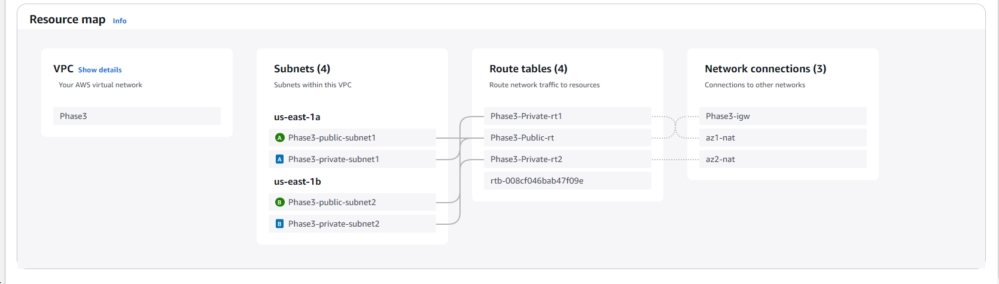

# Phase 3

This phase required me to do the following:

    Task 1: Changing the VPC configuration
    Update or re-create the virtual network components that are necessary to support hosting the database separately from the application.

    Task 2: Creating and configuring the Amazon RDS database
    Create an Amazon Relational Database Service (Amazon RDS) database that runs a MySQL engine. You can choose to create a provisioned instance or run it serverlessly.

    Task 3: Configuring the development environment
    Provision an AWS Cloud9 environment to run AWS Command Line Interface (AWS CLI) commands in later tasks.

    Task 4: Provisioning Secrets Manager
    Use AWS Secrets Manager to create a secret to store the database credentials, and configure the web application to use Secrets Manager.

    Use Script-1 from the following link to create a secret in Secrets Manager by using the AWS CLI: AWS Cloud9 Scripts

    Task 5: Provisioning a new instance for the web server
    Create a new virtual machine to host the web application.

    To install the required web application on the virtual machine, use the JavaScript code from the following link: Solution Code for the App Server

    For the AWS Identity and Access Management (IAM) profile on the EC2 instance, attach the existing LabInstanceProfile profile. This profile attaches an IAM role called LabRole to the instance so that it can fetch the secret securely.

    Task 6: Migrating the database
    Migrate the data from the original database, which is on an EC2 instance, to the new Amazon RDS database.

    Use Script-3 from the AWS Cloud9 Scripts file (cloud9-scripts.yml) to migrate the original data into the Amazon RDS database. Recall that you used a script from this file earlier to create the secret in Secrets Manager.

    Task 7: Testing the application
    Access the application and perform a few tasks to test it. For example, view, add, delete, and modify student records.

## Task 1: Changing the VPC configuration
- I went for the option of recreating the virtual network to host the database seperately from the application. 
    

- As this is a 2-tier application, there is a public subnet to host the web tier and a private subnet to host the databse tier.
- This is replicated across 2 availability zones for increased availability and scalability.

## Task 2: Creating and configuring the Amazon RDS database
- I created an RDS database instance called phase2-db

- These were it's configurations:
    - Engine: MySQL
    - Deployment Option: Multi-AZ DB instance
    - DB instance Class: db.t3.micro (Burstable Class)
    - Storage Type: General Purpose SSD (gp3)
    - Allocated storage: 20GiB

- Initially I had an issue launching the database instance because I was trying to use a 'standard instance' class. However, after getting somme help from a peer, I discovered that burstable classes were the ones allowed for this task.
- Burstable classes are cost-efficient instances for workloads with occasional spikes in CPU usage and they are recommendd for testing or Proof of concept use cases.

## Task 3: Configuring the development environment
- Configured and created a Cloud9 instance as per the innstructions to run AWS CLI commands

## Task 4: Provisioning Secrets Manager
- I opened the Cloud9 environment I created in the previous task and ran the script provided in the lab instructions to create a secret in Secrets Manager by using the AWS CLI.

## Task 5: Provisioning a new instance for the web server
- I was able to launch a new EC2 instance to run the web server using the Shell script provided in the lab instructions

- The web server was up and running but it had no data to show since I had not yet migrated the database

## Task 6: Migrating the database
- Here I was needed to migrate the data from the original database which was deployed on the EC2 from Phase 2, to the new Amazon RDS database.

- The script provided need me to perform an sqldump using the private IP of the Phase2 EC2 instance but I got an error

- I decided to use the public IP instead and the sqldump was successful

- Then run a command to imports the data into RDS database.

- Finally I edited the database security group to allow inbound traffic from the web tier security group

## Task 7: Testing the application
- The database migration was successful as now I can see the student I had previously created
